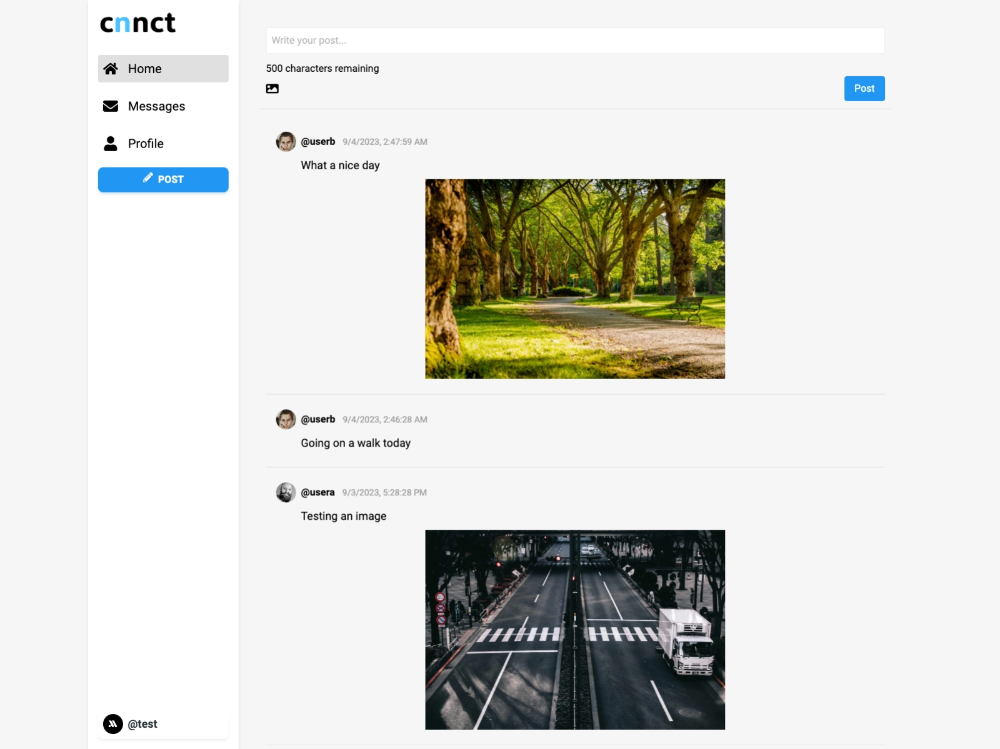

# cnnct Social Media


## Introduction

cnnct is a mockup project for a social media platform, aiming to bring forth a streamlined, user-friendly, and intuitive experience. Crafted using contemporary technologies like React for the frontend and a stack including Node, Express, WebSocket, GraphQL, and MongoDB for the backend. Through intuitive design, users can seamlessly sign in, create accounts, and share their experiences. Feedback mechanisms powered by react-toastify ensure that user actions are acknowledged, fostering a responsive environment. Furthermore, browser-image-compression is integrated for automatic image optimization, ensuring swift interactions and reduced bandwidth usage.

## Table of Contents

- [Features](#features)
- [Demo](#demo)
- [Technologies Used](#technologies-used)
- [Getting Started](#getting-started)

## Features

- **User Profiles**: Simplified profile management with an option to upload a profile image.
- **Real-Time Chat**: Dive into spontaneous conversations with WebSocket underpinning real-time exchanges.
- **Post**: Express yourself; share your thoughts, ideas, and enriching experiences.
- **Responsive Design**: Designed for flexibility, offering a seamless experience across diverse devices and screen dimensions.
- **Image Optimization**: Automatic image compression ensures optimal loading times and efficient bandwidth use.
- **User Feedback**: Instant feedback via toast notifications enhances user interaction and experience.

## Demo

**Note:** Initialization might take a brief moment.
<br>
Experience the live demo here: [cnnct-social.vercel.app](https://cnnct-social.vercel.app/)
<br>


## Technologies Used

- **Frontend**:

  - **[React](https://reactjs.org/)**: Leveraging React for constructing efficient, dynamic user interfaces.
  - **[Redux](https://redux.js.org/) & [React-Redux](https://react-redux.js.org/)**: For state management and ensuring smooth interactions within the application.
  - **[React Router Dom](https://reactrouter.com/)**: Handling and navigating between different views and routes.
  - **[Socket.io Client](https://socket.io/docs/v4/client-api/)**: Facilitating real-time communication between the server and the frontend.
  - **[Material Tailwind](https://material-tailwind.com/)**: Implementing a stylish and consistent design system.
  - **[React Icons](https://react-icons.github.io/react-icons/)**, **[React Infinite Scroll Component](https://www.npmjs.com/package/react-infinite-scroll-component)**, **[React Modal](https://www.npmjs.com/package/react-modal)** & **[React Toastify](https://fkhadra.github.io/react-toastify/)**: Enhancing UI/UX components.
  - **[TypeScript](https://www.typescriptlang.org/)**: Enhances JavaScript with static types for a robust codebase.

- **Backend**:
  - **[Node.js](https://nodejs.org/) & [Express](https://expressjs.com/)**: Offering a sleek Node.js application framework enriched with powerful tools for web and mobile apps.
  - **[GraphQL](https://graphql.org/)**: A query language for APIs, ensuring optimized data fetching.
  - **[WebSocket](https://developer.mozilla.org/en-US/docs/Web/API/WebSocket) & [Socket.io](https://socket.io/)**: Real-time bidirectional event-based communication.
  - **[MongoDB](https://www.mongodb.com/) & [Mongoose](https://mongoosejs.com/)**: MongoDB as a flexible NoSQL database complemented by Mongoose for structured data models in Node.js.
  - **[Passport](http://www.passportjs.org/) & [JWT](https://jwt.io/)**: For authentication and secure data exchange.
  - **[Multer](https://www.npmjs.com/package/multer) & [Cloudinary](https://cloudinary.com/)**: Handling and storing image uploads efficiently.
  - **[Nodemon](https://nodemon.io/) & [TypeScript](https://www.typescriptlang.org/)**: Enhancing the development experience with live reloads and static types.

## Getting Started

### Prerequisites

- Node.js (v16.16.0 recommended)
- Yarn or npm
- A local or remote instance of MongoDB

### Installation

1. Clone the repository:

   ```bash
   git clone https://github.com/your-username/cnnct-social-media.git
   cd cnnct-social-media
   ```

2. Set Up Environment Variables for the Server:
   Navigate to the server directory and create a `.env.local` file with the following variables:

   ```
   MONGO_URI=<Your MongoDB URI>
   SESSION_SECRET=<Your Session Secret>
   PORT=<Your Chosen Port, e.g., 8080>
   JWT_SECRET=<Your JWT Secret>
   CLOUDINARY_CLOUD_NAME=<Your Cloudinary Cloud Name>
   CLOUDINARY_KEY=<Your Cloudinary Key>
   CLOUDINARY_SECRET=<Your Cloudinary Secret>
   CLOUDINARY_FOLDER=<Your Cloudinary Folder>
   ```

3. Set Up Environment Variables for the Client:
   Inside the client directory, create another `.env.local` file and add:

   ```
   REACT_APP_API='http://localhost:8080'
   ```

   Adjust the port (`8080` in this example) if you set a different one for the backend.

4. Install Dependencies:

   - For the server:

     ```bash
     cd server
     npm install
     ```

   - For the client:
     ```bash
     cd client
     npm install
     ```

5. Run the Application:

   - Start the server:

     ```bash
     cd server
     npm start
     ```

   - Start the client:
     ```bash
     cd client
     npm start
     ```

6. Access the App:
   Open your browser and visit [http://localhost:3000](http://localhost:3000) to interact with cnnct.
